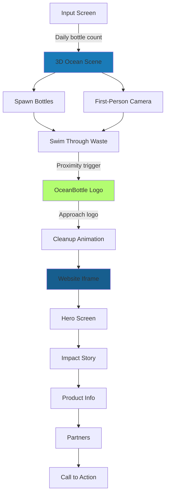

# 🌊 OceanBottle

An immersive 3D experience that visualizes your plastic bottle usage. Swim through an ocean filled with your waste, then learn how Ocean Bottle is making a difference.

## Video Demo

https://github.com/user-attachments/assets/c0a27053-9bd4-4ea3-a088-d39db6fc38b9

## What is this?

You enter how many plastic bottles you use daily. We spawn that many bottles into a 3D ocean. You swim through them. It's uncomfortable. That's the point.

The experience transitions into a website showcasing [Ocean Bottle](https://oceanbottle.co/) - a company funding ocean cleanup with every purchase.

## Why?

Numbers don't stick. "1,825 bottles/year" means nothing. Swimming through your own plastic waste? That hits different.

I wanted to make environmental impact **visual and emotional** while learning Babylon.js.

## Tech Stack

- **Babylon.js** - 3D ocean rendering with WebGL
- **Vanilla JS** - Clean ES6+, no framework bloat
- **Vite** - Fast dev server and bundler
- **CSS3** - Custom animations and responsive design

## Environmental Impact

Each OceanBottle purchased removes **1,000 bottles (11.368 kg)** of ocean-bound plastic through:
- [rePurpose Global](https://www.repurpose.global/) - Policy & lobbying
- [Plastic Bank](http://www.plasticbank.com) - Coastal cleanups
- [Plastics For Change](https://www.plasticsforchange.org) - Data transparency

**17,802,997+ kg of plastic removed** so far.

## Architecture



## Quick Start

```bash
npm install
npm run dev
```

---

**Made by Shirley Huang** • If this made you rethink plastic bottles, mission accomplished.
