# 🌊 OceanBottle

An immersive 3D experience that visualizes your plastic bottle usage. Swim through an ocean filled with your waste, then learn how Ocean Bottle is making a difference.

## Video Demo

https://github.com/user-attachments/assets/c0a27053-9bd4-4ea3-a088-d39db6fc38b9

## What is this?

You enter how many plastic bottles you use daily. We spawn that many bottles into a 3D ocean. You swim through them. It's uncomfortable. That's the point.

The experience transitions into a website showcasing [Ocean Bottle](https://oceanbottle.co/) - a company funding ocean cleanup with every purchase.

## Why?

When I first calculated that using just 2 plastic bottles a day adds up to over 700 bottles a year, it felt... off. Like I knew it was bad, but I couldn't actually feel it.

So I built this. I wanted to know what it would feel like to swim through my own plastic waste. Turns out, it's uncomfortable. And then when you reach the OceanBottle, everything gets cleaned up - because that's literally what they do. Every bottle you buy funds the removal of 1,000 plastic bottles from the ocean.

Also wanted to learn Babylon.js.

## Tech Stack

- **Babylon.js** - 3D ocean rendering with WebGL
- **Web Speech API** - AI voice narration
- **Web Audio API** - Underwater ambient sound
- **Vanilla JS** - Clean ES6+, no framework bloat
- **Vite** - Fast dev server and bundler
- **CSS3** - Custom animations and responsive design

## Environmental Impact

Each OceanBottle purchased removes **1,000 bottles (11.368 kg)** of ocean-bound plastic through:
- [rePurpose Global](https://www.repurpose.global/) - Policy & lobbying
- [Plastic Bank](http://www.plasticbank.com) - Coastal cleanups
- [Plastics For Change](https://www.plasticsforchange.org) - Data transparency

**17,802,997+ kg of plastic removed** so far.

## Architecture

```mermaid
graph LR
    subgraph Frontend ["Frontend (Vite + Vanilla JS)"]
        A[index.html] --> B[main.js]
        B --> C[app.css]
    end

    subgraph 3D ["3D Engine (Babylon.js)"]
        D[ocean-scene.js] --> E[GLB Models]
        D --> F[WebGL Canvas]
        E --> G[Bottles / Fish / Turtles]
    end

    subgraph Audio ["Audio (Web APIs)"]
        L[Web Speech API] --> M[Voice Narration]
        N[Web Audio API] --> O[Underwater Ambience]
    end

    subgraph Website ["Product Website (Static HTML)"]
        H[buy-now.html] --> I[Hero + Impact Story]
        I --> J[Product Showcase]
    end

    subgraph External ["External"]
        K[oceanbottle.co/cart]
    end

    B -->|Initialize scene| D
    B -->|Trigger narration| L
    B -->|Play ambience| N
    F -->|User completes experience| H
    J -->|Add to Cart| K

    style Frontend fill:#2d3748
    style 3D fill:#1a7bb8
    style Audio fill:#6b46c1
    style Website fill:#175e8e
    style External fill:#38a169
```



## Quick Start

```bash
npm install
npm run dev
```

---

**Made by Shirley Huang** • If this made you rethink plastic bottles, mission accomplished.
